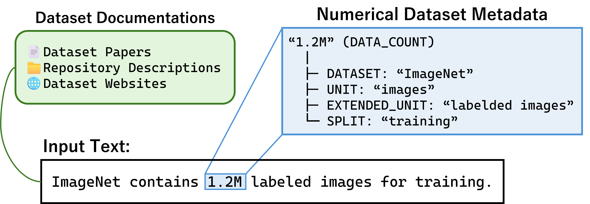

# NIED: Numerical Information Extraction from Dataset Descriptions

Implementation of the NIED system for extracting structured numerical information from dataset documentation.


*Fig. 1: Overview of numerical dataset metadata extraction. Our approach transforms unstructured dataset documentation into structured numerical entities with semantic labels and contextual information.*

-----

## Usage

**Prerequisites:**

  * Place `train.jsonl` and `eval.jsonl` in the `dataset/` directory.

### 1\. Installation

```bash
pip install -r requirements.txt
```

### 2\. Train

Trains both models using the default config. Models are saved to `model/`.

```bash
python main.py --operation train --file_path dataset/train.jsonl
```

### 3\. Predict

Generates predictions using the trained models.

```bash
python main.py --operation predict \
    --file_path dataset/eval.jsonl \
    --numeric_model_path model/numeric_model_roberta-base \
    --context_model_dir model/context_model_roberta-base
```

### 4\. Test (Evaluate)

Evaluates the prediction file against the gold data.

```bash
python main.py --operation test \
    --pred_path predictions/predictions_num-roberta-base_ctx-roberta-base.jsonl \
    --gold_path dataset/eval.jsonl
```

-----

## Command-Line Arguments

### 1\. Common Arguments (All Operations)

| Argument | Default | Description |
| :--- | :--- | :--- |
| `--operation` | **Required** | Mode: `train`, `test`, or `predict`. |
| `--gpu_id` | `0` | GPU ID to use. Set to `-1` for CPU. |
| `--use_timestamp` | `False` | If set, appends a timestamp to output directories/files. |

### 2\. Train Arguments (`--operation train`)

| Argument | Required | Default | Description |
| :--- | :--- | :--- | :--- |
| `--file_path` | **Yes** | - | Path to the training data file (`.jsonl`). |
| `--config_path` | No | `config/config_roberta-base.cfg` | Path to the spaCy training config file. |
| `--type` | No | `both` | Model type to train: `numeric`, `context`, or `both`. |
| `--numeric_model_path`| No | Auto-gen | Directory to save the numeric model. |
| `--context_model_dir` | No | Auto-gen | Directory to save the context model. |

### 3\. Predict Arguments (`--operation predict`)

| Argument | Required | Default | Description |
| :--- | :--- | :--- | :--- |
| `--file_path` | **Yes** | - | Path to the input text data file (`.jsonl`). |
| `--numeric_model_path`| **Yes**\* | - | Path to the trained numeric model. |
| `--context_model_dir` | **Yes**\* | - | Path to the trained context model. |
| `--output_path` | No | `predictions/...` | Path to save the prediction JSONL file. |

*\*Required if using dual models (default behavior).*

### 4\. Test Arguments (`--operation test`)

| Argument | Required | Default | Description |
| :--- | :--- | :--- | :--- |
| `--pred_path` | **Yes** | - | Path to the prediction file generated by `predict`. |
| `--gold_path` | **Yes** | - | Path to the ground truth (gold) file. |
| `--match_type` | No | `exact` | Matching criteria: `exact` or `boundary`. |
| `--numeric_labels` | No | `labels/numeric_labels.txt` | Path to the numeric labels definition file. |
| `--output_path` | No | `evaluations/...` | Path to save the evaluation result JSON file. |

-----

## Data Format

JSONL format.

```json
{
  "id": "yh73HXd6EinUrPrh",
  "text": "The dataset contains 10,000 training samples.",
  "entities": [
    {"id": 343996, "label": "DATA_COUNT", "start_offset": 21, "end_offset": 27},
    {"id": 343997, "label": "SPLIT", "start_offset": 28, "end_offset": 36}
  ],
  "relations": [
    {"from_id": 343996, "to_id": 343997, "type": "has_context"}
  ]
}
```